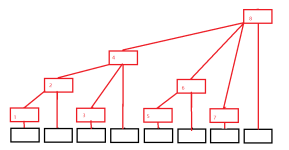
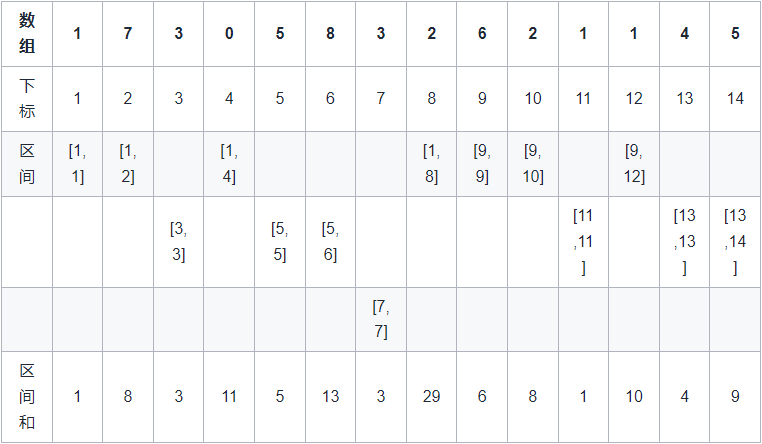

# 树状数组/二叉索引树
多用于高效计算数列的前缀和， 区间和。<br>
正如所有的整数都可以表示成2的幂和，我们可以把一串序列表示成一系列子序列的和。采用这个想法，我们可将一个前缀和划分成多个子序列的和，而划分的方法与数的2的幂和具有极其相似的方式。一方面，子序列的个数是其二进制表示中1的个数，另一方面，子序列代表的f[i]的个数也是2的幂。<br>
它可以以 O(log n) 的时间得到任意前缀和,并同时支持在 O(log n)) 时间内支持动态单点值的修改。空间复杂度 O(n)。
# 基本原理
## 建立部分
### 建表
<br>
红色的为树状数组C，黑色的为原数组V。<br>
树状数组下标从1开始，为方便描述，假设V的下标也是从1开始<br>
每次填坑的位置代表长度为2^n的区段的区段和，填完一次以后重新扫没填过的地方从头计数，区段碰到填过的地方时即跳过继续往后重新计数继续填。<br>
e.g.长度14的数组，第一次填：<br>
1,2,4,8<br>
第二次填:<br>
3,5,6,9,10,12<br>
第三次填:<br>
7,11,13,14<br>
其中每个位置代表的区间和如下：
C[1] = V[1]  
C[2] = V[1] + V[2]  
C[4] = V[1] + ... + V[4]  
C[8] = V[1] + ... + V[8]  
C[3] = V[3]  
C[5] = V[5]  
C[6] = V[5] + V[6]  
C[9] = V[9]  
C[10] = V[9] + V[10]  
C[12] = V[9] + ... + V[12]  
...  
如果理解有障碍可以参考下图：<br>
<br>
实际上，C[i]可以那么理解：<br>
e.g. i=(1010)b，第1个1表示1000，表示它覆盖了8个数据了，但它不是最后1个1，不取具体元素。<br>
第2个1表示10，表示它覆盖了2个元素，它是最后1个1，取这些元素，即V[9] + V[10]，正好符合上述的填表结果。<br>
再直白一点，对于i，将最后1个1置为0后的数据即为起始位置，最后1位1所在的位置决定了区段的大小。<br>
### 代码
```cpp
template<Typename T>
class Binary_indexed_Tree{
public:
    Binary_indexed_Tree(vector<T> origin);
private:
    vector<T> box;
};
int lowbit(int x){  //求最后一位1，原理如下
    return x & -x;
}
template<Typename T>
Binary_indexed_Tree::Binary_indexed_Tree(vector<T> origin){
    box.resize(origin.size() + 1);
    for(int i = 1; i < box.size(); i++){
        for(int t = 0; t < lowbit(i); t++){
            box[i] += origin[i - lowbit(i) + t];
        }
    }
}
```
### 计算前缀和
那么想要计算前14个元素的区段和该如何计算呢？14=(1110)b，那么我们只需选择C[(1110)b], C[(1100)b], C[(1000)b]，即每次去掉最后1个1，将这三者相加即可<br>
怎么取到最后一位的1到底在哪一位呢？只需要做x&(-x)即可<br>
e.g. ~(0011) = 1100, 1100 + 1 = 1101, 1101 & 0011 = 0001<br>
原理？想一想就出来了。<br>
### 代码
```cpp
int getSum(int x){
    int res = 0;
    while(x > 0){
        res += x;
        x -= lowbit(x);
    }
    return res;
}
```
## 更新数据
对于普通数组，添加数据后维护前缀和需要O(n)的时间复杂度，而树状数组只需要O(logn)的时间复杂度。
### 原理
假设我们需要执行V[5] + 2，树状数组中的那些项需要被更改呢？<br>
C[5]肯定要，C[6]也要，C[8]好像也要，那么有没有规律？<br>
5=(0101)b  
6=(0110)b  
8=(1000)b  
只要每次进行x + (x & -x)就可以了，是不是很简单？<br>
什么，原理？这太难想了，懒得想了，记下来差不多得了。
### 代码
```cpp
void add(int x, int v){
    while(x < box.size()){
        box[x] += v;
        x += lowbit(k);
    }
}
```